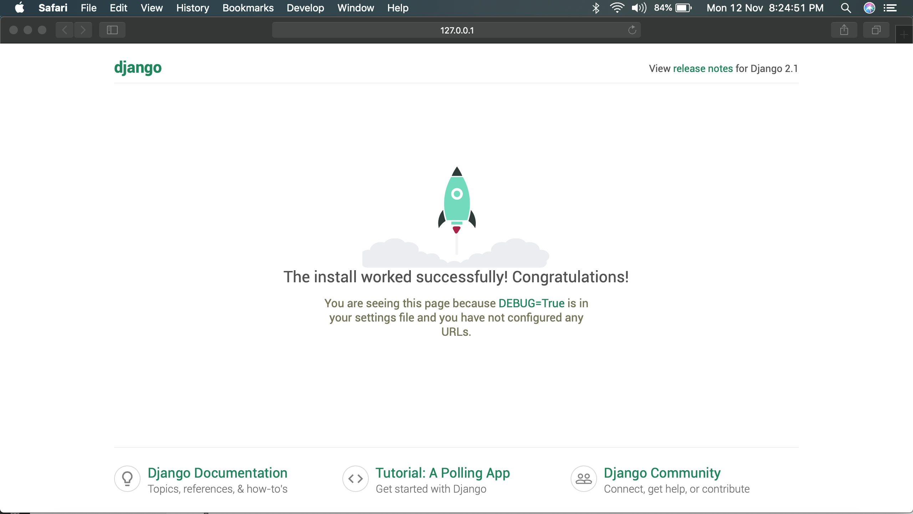

# Getting started with Django

* <a href="#install_django">Install Django</a>
* <a href="#creating_a_project">Creating a project</a>

<div id="install_django">

### Installing Django

There are different methods to install Django on your computer.

The best method for most users is to install an official release. Run the following command from your terminal (command prompt on Windows).

```unix
pip install Django
```

Or if pip is not available at the propmpt, 

```unix
python -m pip install Django
```

Verifying:


To verify that Django can be seen by Python, type `python` from your shell. Then at the Python prompt, try to import Django:

```python
>>> import django
>>> django.get_version()
'2.1'
>>> 
```

Alternately, you may try the following command from your terminal (command prompt on Windows):

```unix
python -m django --version
```


You may have another version of Django installed.


</div>


<div id="creating_a_project">

### Creating a project

To create a new project (website), run the following command from a terminal:

```unix
django-admin startproject mysite
```

This will create the following folder/files in your current directory:

```unix
mysite/
├── manage.py
└── mysite
    ├── __init__.py
    ├── settings.py
    ├── urls.py
    └── wsgi.py
```

These files are:

* The outer mysite/ root directory is just a container for your project. Its name doesn’t matter to Django; you can rename it to anything you like.
* **manage.py**: A command-line utility that lets you interact with this Django project in various ways. You can read all the details about manage.py in django-admin and manage.py.
* The inner **mysite/** directory is the actual Python package for your project. Its name is the Python package name you’ll need to use to import anything inside it (e.g. mysite.urls).
* **mysite/__init__.py**: An empty file that tells Python that this directory should be considered a Python package. If you’re a Python beginner, read more about packages in the official Python docs.
* **mysite/settings.py**: Settings/configuration for this Django project. Django settings will tell you all about how settings work.
* **mysite/urls.py**: The URL declarations for this Django project; a “table of contents” of your Django-powered site. You can read more about URLs in URL dispatcher.
* **mysite/wsgi.py**: An entry-point for WSGI-compatible web servers to serve your project. See How to deploy with WSGI for more details.


Django ships with a development server. Use the `cd` command to change the directory to the outer **mysite** directory and issue the following command:

```unix
python manage.py runserver
```

Here is the typicall output:

```unix
don $ python3 manage.py runserver
Performing system checks...

System check identified no issues (0 silenced).

You have 15 unapplied migration(s). Your project may not work properly until you apply the migrations for app(s): admin, auth, contenttypes, sessions.
Run 'python manage.py migrate' to apply them.

November 12, 2018 - 14:53:05
Django version 2.1, using settings 'mysite.settings'
Starting development server at http://127.0.0.1:8000/
Quit the server with CONTROL-C.
```

Open the browser and visit `http://localhost:8080` and you should see the following screen:



</div>

